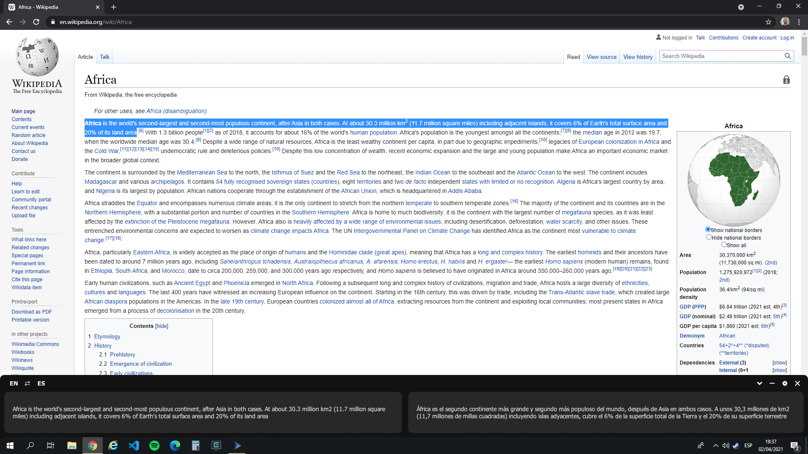

# Drawer Translate 

## Overview

Cross-platform desktop application to translate text using different machine translation APIs. It has been developed under the idea of it doesn't interfer with the rest of our work, so the app is a window at the bottom of your screen that can be resized, minimized, hidden or auto-hidden.

<p align="center">
    
</p>

It is a simple Qt Application with a front-end developed using QML. 

## Dependencies

* **OS**: Linux and Windows. Tested on Ubuntu 16.04, 18.04 and Windows 10.

* [**Qt & QtCreator**](https://www.qt.io/download). Created using Qt 5.14.1

### Windows

* [**OpenSSL**](https://slproweb.com/products/Win32OpenSSL.html). Install 64 or 32 bits version depending on your Qt C++ compiler.

### Linux

* **OpenSSL**. Included in this repository as third-party libraries.
* **GStreamer**. Qt Audio module (QMediaPlayer) use it as backend, so you need to install it to be able to play the text sounds:

    ```bash
    sudo apt-get install libgstreamer1.0-0 gstreamer1.0-plugins-base gstreamer1.0-plugins-good gstreamer1.0-plugins-bad gstreamer1.0-plugins-ugly
    ```

## Compilation

Just open the Qt project file [drawer_translate.pro](drawer_translate.pro) using **QtCreator**, configure it using the default settings for your favorite compiler and build the project.

## Translation APIs

Drawer Translate offers translations from and to different languages using different machine-translation APIs:

* [LibreTranslate](https://libretranslate.com/) - Free and Open Source machine translation API made by [UAV4GEO](https://uav4geo.com/) and powered by [Argos Translate](https://github.com/argosopentech/argos-translate/).
* [Apertium](https://wiki.apertium.org/wiki/Main_Page) -  Free and Open Source machine translation platform, initially aimed at related-language pairs but expanded to deal with more divergent language pairs (such as English-Catalan).
* [MyMemory](https://mymemory.translated.net/) by [Translated Labs](https://translatedlabs.com/welcome)- Free and professional translations within the world's largest database of professionally translated content. This database was created from a collection of publicly available bilingual documents of the European Union and the United Nations, and contains more than 40 billion words.
* [GoogleTranslate](https://cloud.google.com/translate/?hl=es) - Google Cloud translation API. Nowadays is not free and you need a Key to use the API, but you can get a [trial](https://translatepress.com/docs/automatic-translation/generate-google-api-key/) to use it for some months.


## Settings

Drawer translate provides a settings windows where you can select between the previous translation APIs, the source and target languges (depending on which API you selected) and some other features:

* *Translate on selection*: Allows this app to translate directly the selected text in another apps. For now, it only works in Linux systems.
* *Translate on copy*: Allows this app to translate directly the clipboard incoming text. So, you just need to copy some text (Ctrl+C) to get the translation.
* *Auto-hide window*: Hides the app window when you move out of the application.
* *Appearance*: As we are not all from the same soccer team, you can also select the colors that you prefer for this app background, foreground and text.

All this seetings are saved on your computer and can be edited manually (something important if you have selected all colors equal to white :sweat_smile:):

* `C:\Users\<USER>\AppData\Roaming\DrawerTranslate/DrawerTranslate.ini` on Windows.
* `~/.config/DrawerTranslate/DrawerTranslate.ini` on Linux.

## Known issues

1. QNetworkManager library throws the following errors on Windows:

    ```bash
    qt.network.ssl: QSslSocket::connectToHostEncrypted: TLS initialization failed
    ```

    Fix: Install OpenSSL on the system (C:\Windows\System32). [Reference](https://stackoverflow.com/questions/53805704/tls-initialization-failed-on-get-request)

2. QMediaPlayer library throws the following warning on Linux when try to play a text sound:

    ```bash
    Warning: "No decoder available for type 'audio/mpeg, mpegversion=(int)1, mpegaudioversion=(int)2, layer=(int)3, rate=(int)24000, channels=(int)1, parsed=(boolean)true'."
    Error: "Your GStreamer installation is missing a plug-in."
    ```
    
    Fix: Install [GStreamer](###Linux).